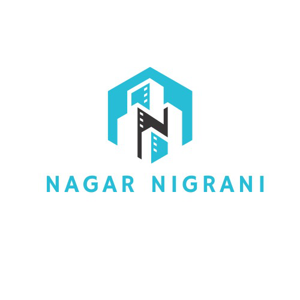

# Nagar Nigraani

<p align="center">
	
</p>

Nagar Nigraani is a web-based civic complaint management system. Citizens can report traffic and civic issues with location and evidence, officials can process and resolve them through a structured workflow, and the platform keeps users informed with notifications, ratings, SLA tracking, and gamification.

## Project Overview

This project was built as a final-year Web Technology application to demonstrate a real-world civic workflow. It combines a modern React frontend, a Node.js and Express backend, MongoDB persistence, AI-assisted complaint triage, location tracking, and role-based dashboards for citizens and officials.

The main goal is simple: make complaint reporting easy for citizens and make complaint handling organized, transparent, and measurable for officials.

## Problem Statement

Urban complaint systems are often slow, fragmented, and difficult for citizens to use. People may not know where to report issues, how to attach proof, or whether their complaint is actually being handled. On the other side, officials need a clean queue, proper prioritization, SLA awareness, and reliable complaint history.

Nagar Nigraani solves this by providing one platform where:

- citizens can report issues from the web/mobile browser,
- location and media evidence are attached automatically,
- AI helps suggest complaint category and severity,
- officials manage complaints through workflow lanes,
- citizens can track status updates and submit ratings after resolution.

## Key Features

- Citizen and official role-based access
- Complaint reporting with title, details, location, and media upload
- AI-based complaint classification and evidence review support
- Complaint tracking with status timeline and official outcome details
- Official dashboard with Active, SLA Breached, Resolved, and Rejected lanes
- Notifications for assignment, status changes, and rating requests
- SLA tracking and escalation support
- Gamification with points, ranks, and a points ledger
- Complaint heatmap for hotspot visualization
- Progressive Web App support for an app-like experience
- Mobile responsive UI

## Technology Stack

### Frontend

- React
- Vite
- Tailwind CSS
- Material UI
- React Router
- Axios
- React Toastify
- Leaflet and Leaflet Heat
- Font Awesome
- Vite PWA plugin

### Backend

- Node.js
- Express.js
- MongoDB
- Mongoose
- JSON Web Token authentication
- bcryptjs for password hashing
- CORS
- Morgan for request logging

### External Services

- Cloudinary for media uploads
- Gemini API for AI classification and image analysis
- Browser Geolocation API for user location
- Nominatim reverse geocoding for address lookup
- BigDataCloud as geocoding fallback

## System Architecture

The application follows a standard full-stack flow:

1. User interacts with the React interface.
2. Frontend sends requests through Axios.
3. Axios automatically attaches the JWT token.
4. Express routes receive the request.
5. Authentication and role middleware validate access.
6. Controller logic applies business rules.
7. Mongoose stores and retrieves data from MongoDB.
8. Response is returned to the frontend.
9. UI updates based on the server result.

## User Roles

### Citizen

- Register and login
- Create and submit complaints
- Upload image evidence
- Detect current location
- Track complaint progress
- View timeline, resolution proof, and rejection notes
- Rate the final resolution
- View notifications and points activity

### Official

- Login to official dashboard
- View complaint queues by workflow lane
- Assign, start, resolve, or reject complaints
- Add notes and outcome details
- Review AI-flagged complaints
- Monitor analytics, SLA breaches, and heatmap patterns

### Admin

- Access higher-level user and reassignment controls
- Support official operations where needed

## Complaint Workflow

The complaint lifecycle is designed as a workflow, not just a single form submission.

### Status Flow

- Open
- Assigned
- InProgress
- Resolved
- Closed
- Rejected

### Typical Citizen Flow

1. Citizen logs in.
2. Opens the complaint form.
3. Detects location automatically.
4. Adds complaint title and description.
5. Uploads image proof if available.
6. Optionally receives an AI suggestion for category and severity.
7. Submits the complaint.
8. Complaint appears in the citizen dashboard.
9. Citizen tracks updates until final outcome.
10. If resolved, citizen sees before/after proof and submits a rating.

### Typical Official Flow

1. Official logs in.
2. Reviews complaints in workflow lanes.
3. Assigns or claims a complaint.
4. Marks work as in progress.
5. Resolves the issue with proof and note, or rejects it with a reason.
6. Citizen receives notifications.
7. Complaint is moved to the resolved or rejected view.

## AI Flow

AI is used to support, not replace, the official decision process.

### What AI Does

- Suggests complaint category
- Suggests severity level
- Analyzes text and image consistency
- Produces confidence and reliability signals
- Flags suspicious or mismatched evidence for review

### AI Review Strategy

- High-confidence and consistent complaints can move normally.
- Unclear or mismatched complaints are sent to the AI review queue.
- Officials can review and override AI suggestions.

## Database Models

### User

Stores identity, role, points, rank, trust score, and account status.

### Complaint

Stores complaint content, category, severity, department, zone, SLA, geolocation, media URLs, workflow status, assignee, AI suggestion, rating, comments, and resolution/rejection metadata.

### AIAssessment

Stores the AI triage record, including predicted category, severity, reliability class, review decision, and trust impact.

### Notification

Stores message-based notifications linked to users and optionally to complaints.

### PointsLedger

Stores every gamification reward action for auditing and display.

### ComplaintEvent

Stores complaint timeline history such as assignment, status change, comment, and rating actions.

## API Summary

### Auth APIs

- `POST /api/auth/register` - Register a citizen user
- `POST /api/auth/login` - Login and receive token
- `GET /api/auth/me` - Get the current logged-in user

### Complaint APIs

- `GET /api/complaints/taxonomy` - Get complaint categories and severity defaults
- `POST /api/complaints` - Create a complaint
- `GET /api/complaints` - Get complaint list for officials
- `GET /api/complaints/mine` - Get complaints created by the logged-in user
- `GET /api/complaints/:id/events` - Get complaint timeline events
- `GET /api/complaints/heatmap` - Get map points for complaint heatmap
- `GET /api/complaints/analytics/summary` - Get dashboard metrics
- `PATCH /api/complaints/:id/status` - Update complaint status
- `PATCH /api/complaints/:id/assign-me` - Assign complaint to self
- `PATCH /api/complaints/:id/start` - Mark complaint as InProgress
- `PATCH /api/complaints/:id/reassign` - Reassign complaint
- `POST /api/complaints/:id/comments` - Add a comment
- `POST /api/complaints/:id/rating` - Submit citizen rating

### AI APIs

- `POST /api/ai/classify-complaint` - Classify complaint using AI
- `GET /api/ai/review-queue` - Get AI review queue
- `PATCH /api/ai/review-queue/:id/review` - Submit AI review decision

### Notification APIs

- `GET /api/notifications/mine` - Get my notifications
- `PATCH /api/notifications/:id/read` - Mark one notification as read
- `PATCH /api/notifications/read-all` - Mark all notifications as read
- `DELETE /api/notifications/:id` - Delete one notification
- `DELETE /api/notifications/mine/read` - Delete all read notifications

### User APIs

- `GET /api/users/:id` - Get user by id
- `GET /api/users/leaderboard` - Get citizen leaderboard
- `GET /api/users/me/gamification-summary` - Get points summary and badges
- `GET /api/users/me/points-ledger` - Get points history
- `GET /api/users` - List users for officials/admins

## Environment Variables

### Frontend `.env`

```env
VITE_API_BASE_URL=http://localhost:5000/api
VITE_CLOUDINARY_CLOUD_NAME=
VITE_CLOUDINARY_UPLOAD_PRESET=
```

### Backend `server/.env`

```env
PORT=5000
NODE_ENV=development
MONGODB_URI=mongodb://127.0.0.1:27017/nagar_nigraani
JWT_SECRET=replace_with_strong_secret
JWT_EXPIRES_IN=7d
CORS_ORIGIN=http://localhost:5173
GEMINI_API_KEY=replace_with_gemini_api_key
GEMINI_MODEL=gemini-2.5-flash
```

## Setup Instructions

### 1. Clone the repository

```bash
git clone [your-repository-url]
cd mobileEASE-main
```

### 2. Install frontend dependencies

```bash
npm install
```

### 3. Install backend dependencies

```bash
cd server
npm install
```

### 4. Configure environment files

- Create a root `.env` from `env.example`
- Create `server/.env` from `server/.env.example`
- Add Cloudinary, MongoDB, JWT, and Gemini credentials

### 5. Start the frontend

```bash
npm run dev
```

### 6. Start the backend

In a second terminal:

```bash
cd server
npm run dev
```

### 7. Open the app

- Frontend: `http://localhost:5173`
- Backend health check: `http://localhost:5000/api/health`

## Project Structure

```text
src/
	components/       # Reusable UI components
	pages/            # Main app pages
	utils/            # API helpers and utility functions
server/
	src/
		controllers/    # Business logic for each route group
		models/         # Mongoose schemas
		routes/         # Express route definitions
		middleware/     # Auth and error handling
		utils/          # Shared backend utilities
```

## Main UI Screens

- Home page
- Citizen login and register
- Official login
- Citizen dashboard
- Report complaint page
- Track complaints view
- Official dashboard
- Complaint detail modal
- Notification panel

## Why This Project Is Strong

- It solves a real civic problem.
- It uses a proper full-stack architecture.
- It includes workflow management, not only CRUD.
- It combines AI with human review.
- It supports SLA, notifications, and feedback.
- It demonstrates practical product thinking and technical depth.

## Future Scope

- Multilingual support
- Push notifications
- Smarter assignment logic
- Stronger fraud and image manipulation detection
- Support for more cities beyond Pune
- More analytics and reporting options

## License

This project is licensed under the MIT License. See the `LICENSE` file for details.

